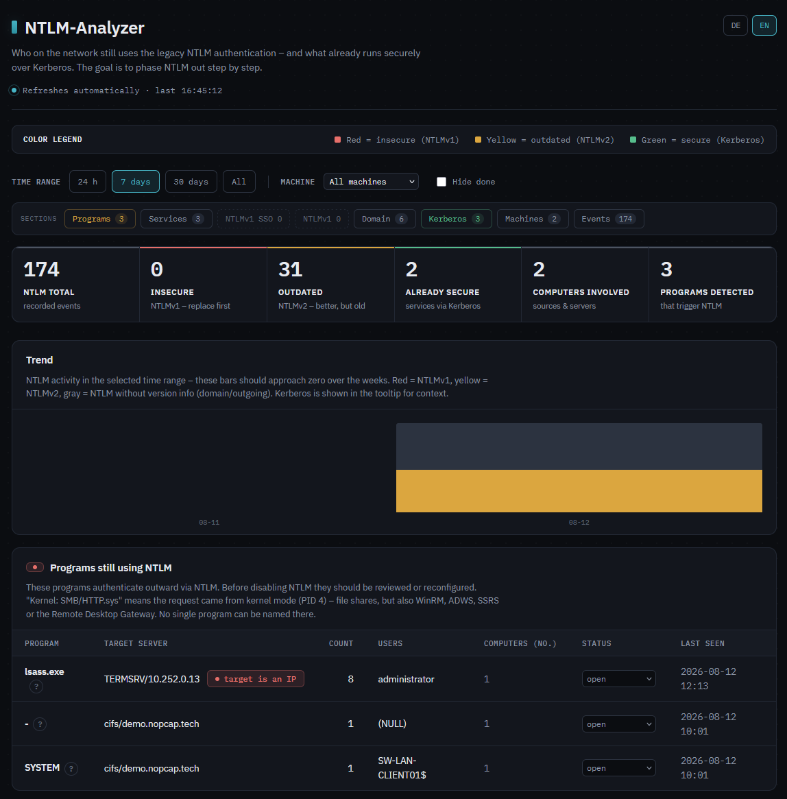
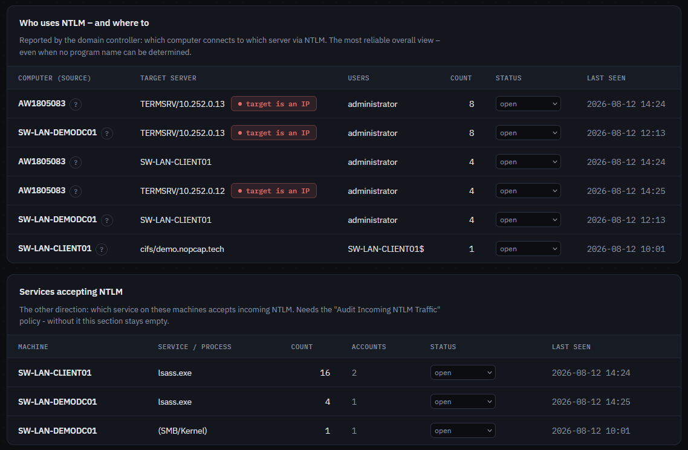
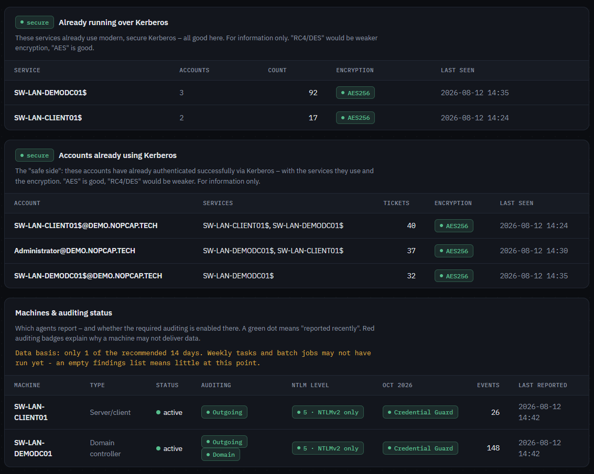
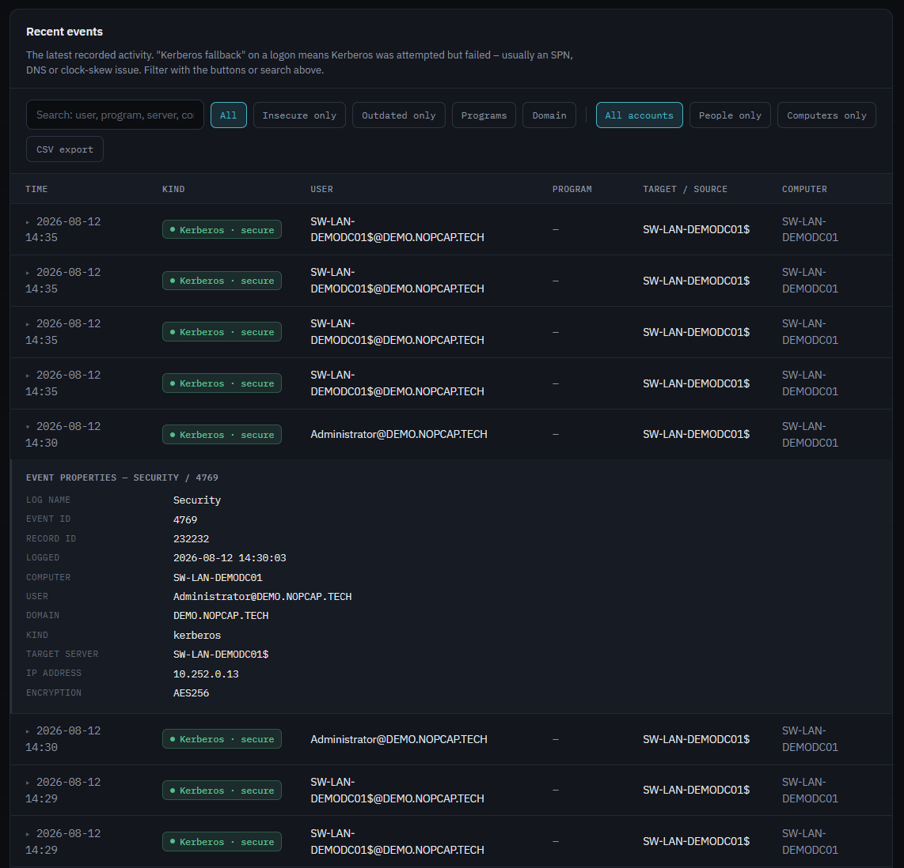

<div align="center">

# 🛡️ NTLM-Analyzer

### Find out who still uses NTLM in your Active Directory — so you can retire it for Kerberos.

A Windows agent plus a central collector with a web dashboard that shows exactly **who still authenticates over NTLM**, what already runs securely over Kerberos, and whether usage is trending toward zero.


&nbsp;

&nbsp;

&nbsp;
[](LICENSE)

[Features](#features) · [Screenshots](#screenshots) · [Quick start](#quick-start) · [Troubleshooting](#troubleshooting)

</div>

---

NTLM-Analyzer answers the question you have to answer before you can turn NTLM off: *who is still using it?* A lightweight Windows service on your domain controllers and member machines collects the relevant security events and pushes them to a central collector. Its web dashboard shows which users, computers and applications still authenticate over NTLM, which of them fell back from Kerberos (and can therefore be fixed), what already runs securely over Kerberos, and whether NTLM usage is trending toward zero.

I worked in the IT services industry for many years and identified many of these issues manually or using scripts at client sites. We handled numerous AD security projects for clients with critical infrastructure. We disabled NTLMv1/NTLMv2 wherever possible and migrated everything to Kerberos. After earning my OSCP and OSEP certifications, I finally wanted a tool that would significantly help with this work, since far too many companies still rely on NTLMv1 and NTLMv2.

The collector is a single Python file with no external dependencies; the agent is a single, self-installing executable.

> [!NOTE]
> **Built with AI assistance.** Most of the code and documentation in this repository was written by Claude (Anthropic) in a pair-programming workflow: I defined the requirements, reviewed the results, and tested and deployed everything in a real Active Directory environment. As with any code you did not write yourself, review it before running it in production.

---

## Contents

- [Components](#components)
- [Features](#features)
- [Screenshots](#screenshots)
- [Prerequisites](#prerequisites)
- [Quick start](#quick-start)
- [CLI reference](#cli-reference)
- [Troubleshooting](#troubleshooting)
- [Before you switch NTLM off](#before-you-switch-ntlm-off)
- [Limitations & notes](#limitations--notes)
- [Repository layout](#repository-layout)

---

## Components

| Component | File(s) | Platform | Description |
| --- | --- | --- | --- |
| **Collector** | `ntlm-collector.py` | Linux (any OS with Python 3.7+) | HTTP(S) server with ingest API, SQLite storage and an embedded web dashboard. Standard library only. |
| **Agent** | `ntlm-agent-rs/` | Windows (server & client, x64) | Native **Windows service** written in Rust (LocalSystem or a dedicated service account / gMSA, auto-start, auto-restart on crash). A single, dependency-free EXE. |

One agent runs per machine — on domain controllers and member machines alike.

```
┌──────────────┐   ┌──────────────┐   ┌──────────────┐
│ DC (agent)   │   │ Server(agent)│   │ Client(agent)│
└──────┬───────┘   └──────┬───────┘   └──────┬───────┘
       │  POST /ingest + /status (HTTPS, X-Api-Key)  │
       └──────────────────┼──────────────────────────┘
                          ▼
                 ┌─────────────────┐
                 │    Collector    │  SQLite + web dashboard
                 │  (Python, TLS)  │  (login-protected)
                 └─────────────────┘
```

---

## Features

### Collection

| Event | Where | What it contributes |
| --- | --- | --- |
| **4624** | DCs (Security log) | NTLM logons with **v1/v2 distinction** via `LmPackageName` — which also catches **Negotiate→NTLM fallbacks** that a filter on `AuthenticationPackageName='NTLM'` would miss. Each event carries `auth_method = Direct \| Fallback`. |
| **8001** | all machines | **Outgoing** NTLM including the originating process — the "shutdown blocker" list. Requests handled in kernel mode (PID 4) are labeled `(Kernel: SMB/HTTP.sys)` — that covers file shares as well as WinRM, ADWS, SSRS and the Remote Desktop Gateway, none of which can be attributed to a single process. |
| **8002** | all machines *(optional)* | **Incoming** NTLM that needs *no* domain controller to validate it — local accounts and loopback authentication. Carries the **calling process**, so it names the local service involved. |
| **8003** | member servers *(optional)* | **Incoming** NTLM with a **domain account** (validated by a DC): remote account, client machine, logon type and the **process that was accessed** (e.g. `w3wp.exe`). Together with 8002 this answers "which service accepts NTLM". |
| **4013/4014** | all machines | **Credential Guard blocks.** Credential Guard is on by default on Server 2025 and Windows 11 24H2; when it refuses the credential key, the attempt never reaches the regular NTLM audit path — the machine then looks *clean* while NTLM is in fact being attempted. **4013** is field-rich (target server, account, calling process, and it is NTLMv1 by definition), **4014** names only the calling process. Machines producing them get a badge saying their findings are incomplete rather than empty. |
| **4001–4006** | all machines / DCs | The **enforce twins** of 8001–8006: once a deny policy is active, events switch IDs (8001→4001 and so on) with identical layout. Collected so the dashboard stays sighted during enforcement — blocked authentications appear as a red **blocked** badge. **4004** is also what fires for the MS-CHAPv2 blind spot. |
| **8005/8006** | DCs | Two blind spots most setups miss: **8005** is NTLM straight *to the domain controller* (e.g. a type 3 logon to the DC), **8006** a request from a **trusted domain**. Same field layout as 8004; under enforcement they become 4005/4006. |
| **8004** | DCs | NTLM authentication inside the domain (source → target → user). |
| **4769** | DCs | Kerberos service tickets — the "safe side" for contrast. **Failed requests are kept too**: on systems without the 40xx events (2016/2019/2022) the failure code (e.g. `0x7` = SPN not found) is the only early warning for NTLM-fallback causes; they feed the *Why NTLM?* panel. Needs *Audit Kerberos Service Ticket Operations* incl. **Failure**. |
| **4020/4021** | Win11 24H2 / Server 2025 | **Enhanced client auditing** (KB5064479): outgoing NTLM with process, **NTLM version and the reason** Kerberos was not used (e.g. "target name contains an IP address"). Odd IDs flag a downgrade. |
| **4022/4023** | Win11 24H2 / Server 2025 | **Enhanced server auditing**: incoming NTLM with source machine, client IP, target SPN and version — feeds the domain view. |
| **4030–4033** | Server 2025 DCs | **Enhanced domain-wide auditing**: the NTLM version straight from the DC log — no longer requires collecting 4624 from every machine. **4032/4033** cover same-domain authentication, **4030/4031** cross-domain; the odd ID of each pair marks a security downgrade. |
| **4024/4025** | Win11 24H2 / Server 2025 | **NTLMv1-derived SSO credentials** used (4024) or already blocked (4025). Microsoft flips the default to *enforce* in **October 2026** — these logons will then break on their own. |
| `/status` | all machines | Heartbeat plus the machine's auditing state, read from the registry. |

On systems older than Windows 11 24H2 / Server 2025 the enhanced queries simply return nothing — the agent handles both worlds with the same binary. The enhanced events also arrive via a **controlled feature rollout** (clients since Sep 2025, Server 2025 since Nov 2025), so a fully patched system may still need a current cumulative update before they appear.

Watermarks are tracked per source and purpose, so only new events are transferred; the collector deduplicates on `(source, log, record_id)`.

### Dashboard

- **German / English UI** with a DE/EN toggle in the header — the choice is remembered in the browser and also applies to the login page.
- Dark, technical design. No external chart libraries, so it works on hosts without internet access.
- **Time-range filter** (24 h / 7 days / 30 days / all), applied server-side to every metric, table and the event list.
- **Trend chart**: NTLM activity per day (per hour in the 24 h view), stacked by v1 / v2 / unversioned — the curve that has to reach zero.
- **Work lists with status**: blocker and domain entries can be set to *open / in progress / done* (persisted). If a "done" entry produces new events, a red **"active again"** badge appears automatically.
- **Credential Guard blind spot**: on machines with Credential Guard (default on Server 2025 / Windows 11 24H2) blocked NTLM attempts bypass the normal audit events entirely. Events 4013/4014 are collected so those machines show *what was attempted and refused* instead of an empty — and misleading — findings list.
- **Timing heatmap**: weekday against hour of day. Batch jobs, maintenance windows and weekend scripts are the stragglers that break a shutdown — as single numbers they hide in the daily trend, as a pattern they stand out. The busiest slot is named below the grid.
- **Per-program trend**: each row in the program list carries a sparkline over the selected range. A rising line inside a falling overall trend is the row to tackle first.
- **Machine configuration, not just behaviour**: each agent reports its OS version and build (so an empty findings list on a 2019 box is explained rather than misread), the three *Restrict NTLM* deny policies (allow / deny-accounts / deny-all — a progress display for staged rollouts), and the exception lists already configured in policy.
- **Full program path**: tables group by file name (one `svchost.exe` row), while the event detail and CSV carry the full image path — for generic process names that path is what identifies the actual application.
- **Exception-list generator**: one click turns the still-open rows into a paste-ready server list for the two *Restrict NTLM* exception policies (outgoing on clients, domain on DCs) — SPN prefixes stripped, duplicates merged, done items excluded. An exception is a stay of execution, not a fix; the box says so too.
- **Enforcement visibility**: the blocked events 4001–4006 are collected alongside their audit twins, so the moment a deny policy goes live (even on a single test machine) the dashboard shows what got blocked instead of going dark.
- **Log-size guard**: the agent reports the configured size of the NTLM/Operational log; the machine list warns when it is below 16 MB, because the OS default (~1 MB) can roll over between two poll cycles once incoming auditing is active — silently losing events. One-liner fix: `wevtutil sl Microsoft-Windows-NTLM/Operational /ms:20971520`.
- **"Why NTLM?" panel**: groups every fallback by the *Usage ID* Windows reports (KB5064479) — target name is an IP, SPN duplicated in AD, no line of sight to a DC, application called NTLM directly, and so on. Each cause is shown with its own remediation, which turns a list of findings into a list of fixes. On Server 2025 / Windows 11 24H2 the panel is fed by the Usage IDs; on older systems (2016/2019/2022) it is fed by **failed Kerberos requests** (4769 failure codes such as `0x7` = SPN not found) — so mixed environments get the cause analysis everywhere.
- **Relay exposure**: the enhanced events also report MIC status and channel binding (EPA). Sessions with an unprotected MIC or missing channel binding are the relay-able ones and are flagged as such — useful for prioritising *which* NTLM to remove first.
- **October 2026 readiness**: the machine list flags which machines the `BlockNtlmv1SSO` switch will actually hit. Machines with **Credential Guard** enabled are exempt (it already prevents NTLMv1 cryptography), and machines already set to enforce have nothing left to come.
- **NTLM level per machine**: the machine list shows each machine's `LmCompatibilityLevel` — which NTLM versions it still *permits*, independent of what it actually used. Level 5 (NTLMv2 only) is the target state before any blocking.
- **Data-basis indicator**: shows how many days of events exist and warns while that is below the recommended two weeks — an empty findings list after two days means little.
- **NTLMv1 SSO deadline panel**: appears automatically (with a red *Deadline* badge) as soon as 4024/4025 events show up — listing who still uses NTLMv1-derived credentials that will stop working in October 2026, with the same open/in-progress/done workflow.
- **Reason display**: for enhanced events, the expandable event detail shows *why* NTLM was used (e.g. "target name contains an IP address") and failed-logon status messages.
- **What-to-do hints** per finding: the IP-instead-of-hostname classic for SMB, SPN checks (`setspn`), the fallback checklist (SPN / DNS / clock skew), switching RC4 tickets to AES (`msDS-SupportedEncryptionTypes`).
- **CSV export** of the current selection (UTF-8 BOM, semicolon delimiter, formula-injection protection).
- Clickable metrics, free-text search, filter chips, auto-refresh, and a machine panel with heartbeat and audit traffic lights.

### Security

- **TLS** built into the collector (`--cert` / `--tlskey`, minimum TLS 1.2); the session cookie becomes `Secure` automatically over HTTPS.
- **Dashboard login** (optional): PBKDF2-HMAC-SHA256 (200,000 iterations), constant-time comparison, `HttpOnly` + `SameSite` cookie, per-source-IP brute-force lockout.
- **API key** for the agent endpoints (`X-Api-Key`, constant-time comparison), separate from the browser login.
- Request size limits, fully parameterized SQL, complete HTML escaping (no stored XSS via event contents), CSV formula-injection protection.
- The agent is a **pure client** (no listening port), ignores collector responses (no control channel), invokes helper binaries only via absolute System32 paths, installs itself into `C:\Program Files\NtlmAgent\`, and restricts the ACL of `C:\ProgramData\NtlmAgent\` to SYSTEM + Administrators (SID-based, locale-independent).

### Operations

- **Retention**: `--retention-days N` deletes old events automatically (at startup and every 6 hours).
- Indexes on all query columns; automatic schema migration at startup — existing databases are upgraded in place.
- Agent: log rotation at 5 MB, atomic watermark writes, 15 s HTTP timeout, per-cycle panic safety net.

---

## Screenshots

### Overview: metrics, trend, and the programs to fix

The top of the dashboard. Global filters (time range, machine, hide-done) sit
above a sticky section bar whose counters show at a glance where findings exist —
greyed-out chips mean "checked, nothing there". The metric cards separate
**insecure** (NTLMv1) from **outdated** (NTLMv2), and the *Programs still using
NTLM* list is the actual shutdown-blocker worklist. Note the red
**target is an IP** badge: Kerberos needs a name with an SPN, so an IP target
can never be anything but NTLM.



### Both directions: who goes out, which services accept

*Who uses NTLM – and where to* comes from the domain controller and is the most
reliable overall view, even when no program name can be determined.
*Services accepting NTLM* is the opposite direction — the local service that
**accepts** incoming NTLM. That section only appears once the
*Audit Incoming NTLM Traffic* policy is active.



### The safe side, and machine readiness

What already runs over Kerberos, shown for contrast rather than as a to-do.
Below it, the machine list: heartbeat, which auditing is enabled, each machine's
**NTLM level** (`LmCompatibilityLevel`; 5 = NTLMv2 only) and the **Oct 2026**
column — machines with Credential Guard are exempt from the `BlockNtlmv1SSO`
default flip. The yellow line above the table warns while fewer than 14 days of
data exist, because an empty findings list means little that early.



### Event list with per-event detail

Every collected event, filterable by kind, NTLM version, account type (people vs.
computers) and free-text search, exportable as CSV. Expanding a row shows the raw
field values as Windows reported them.



---

## Prerequisites

### Auditing (GPO) — required, nothing is collected without it

The agent only reads events that Windows actually writes. Enable the following via Group Policy.

> [!IMPORTANT]
> Events are generated **from the moment auditing is enabled — not retroactively.**

#### On all machines (servers and clients)

`Computer Configuration → Policies → Windows Settings → Security Settings → Local Policies → Security Options`

| Setting | Value | Produces |
| --- | --- | --- |
| Network security: Restrict NTLM: **Outgoing NTLM traffic to remote servers** | `Audit all` | **Event 8001** — outgoing NTLM including the originating process |
| Network security: Restrict NTLM: **Audit Incoming NTLM Traffic** | `Enable auditing for domain accounts` | **Events 8002/8003** — which local service accepts NTLM, and which accounts come in. This is the only way to see the *receiving* process. `Enable auditing for all accounts` also works but adds a lot of loopback noise (the system authenticating to itself, typically RPC endpoint mapper). |

> [!WARNING]
> Choose **`Audit all`**, not `Deny all` — auditing only logs, it blocks nothing.

#### On domain controllers (in addition)

`Computer Configuration → Policies → Windows Settings → Security Settings → Local Policies → Security Options`

| Setting | Value | Produces |
| --- | --- | --- |
| Network security: Restrict NTLM: **Audit NTLM authentication in this domain** | `Enable all` | **Event 8004** — who uses NTLM against which server |

`Computer Configuration → Policies → Windows Settings → Security Settings → Advanced Audit Policy Configuration → Audit Policies`

| Category → Subcategory | Value | Produces |
| --- | --- | --- |
| Logon/Logoff → **Audit Logon** | `Success` | **Event 4624** — the only source of the NTLMv1/v2 distinction and of Kerberos-fallback detection |
| Account Logon → **Audit Kerberos Service Ticket Operations** *(optional)* | `Success and Failure` | **Event 4769** — successes show Kerberos services and accounts ("the safe side"); **failures feed the *Why NTLM?* panel** with the cause (e.g. `0x7` = SPN not found) on systems without the 40xx events |

#### Applying and verifying

```cmd
gpupdate /force
auditpol /get /subcategory:"Logon"
```

The enhanced 40xx auditing (Windows 11 24H2 / Server 2025) is **enabled by default** — no additional GPO is required. If it has been disabled centrally, the switches live under `Computer Configuration → Policies → Administrative Templates → System → NTLM → NTLM Enhanced Logging` (clients/servers) and `… → System → Netlogon → Log Enhanced Domain-wide NTLM Logs` (domain controllers). Both require the current ADMX templates in your central store.

`auditpol` must report **Success** for the Logon subcategory. In the dashboard, the **Machines & auditing status** panel turns its audit badges green as soon as each agent reports in — use it to confirm the policy actually landed on every machine.

### Collector (central server)

- **Python ≥ 3.7** — standard library only, no `pip install` required.
  On AlmaLinux 8 the system Python is 3.6: install `python3.11` and run with that. AlmaLinux 9 (Python 3.9) works out of the box.
- One reachable TCP port (e.g. 8080 for HTTP, 8443 for HTTPS), opened in the host firewall — on RHEL-family systems: `firewall-cmd --add-port=8443/tcp --permanent && firewall-cmd --reload`.
- For HTTPS: certificate and key in PEM format. Recommended: a certificate from your **internal CA (AD CS)** with the collector's DNS name as CN/SAN — every domain member trusts it automatically.

### Agent (each monitored Windows machine)

- Windows Server or client, x64.
- **Administrator rights for installation.** By default the service then runs as `LocalSystem`, which grants the Security-log access needed on domain controllers.
- **Optional, least privilege:** the service can run under a dedicated account or a **gMSA** instead — `--service-account "DOM\gmsa-ntlm$"` (a trailing `$` means no password; Windows retrieves it from AD). Such an account needs *Log on as a service* and membership in **Event Log Readers** (without the latter, 4624/4769 collection silently yields nothing), and for a gMSA the machine's computer account must be listed in `PrincipalsAllowedToRetrieveManagedPassword`. Details and examples: [agent README](ntlm-agent-rs/README.md).
- Network access to the collector's port, and name resolution for the collector host.
- The agent's URL scheme and port must match how the collector was started (`http://` vs `https://`).

### Building the agent (once; a single build machine is enough)

- **Rust toolchain** (`rustup`, stable) with the **MSVC target**, plus the *Visual Studio Build Tools* with "Desktop development with C++".
- Internet access to crates.io for the first build.
- `cargo build --release` produces a single, dependency-free `ntlm-agent.exe` that can be copied to every target machine.
- Optional: sign the EXE with a code-signing certificate from your internal CA (`signtool sign /fd SHA256 /sha1 <thumbprint> /tr <timestamp-url> /td SHA256 ntlm-agent.exe`) to avoid "unknown publisher" prompts and to enable publisher-based AppLocker/WDAC rules.

---

## Quick start

**1. Install the collector** (Linux, as root — detects Debian/RHEL, asks a few questions, sets up a hardened systemd service):

```bash
sudo ./install.sh
```

The installer creates a dedicated system user, stores the dashboard password and API key in a root-only environment file (never on the command line), opens the firewall port on request and prints the finished agent install command. Prefer manual control? Start it directly instead:

```bash
NTLM_DASHBOARD_PASSWORD='StrongPassword' python3 ntlm-collector.py \
    --port 8443 --db /var/lib/ntlm-collector/ntlm.db \
    --key 'AgentSecret' --retention-days 90 \
    --cert /etc/ntlm-collector/server.crt --tlskey /etc/ntlm-collector/server.key
```

Without `--cert`/`--tlskey` the collector runs over plain HTTP (testing only). Without `--password` the dashboard is open, without `--key` the ingest API is open — both are clearly flagged in the startup banner, which also tells you the exact scheme and port the agents must use.

**2. Build the agent** (once, on a Windows machine with Rust):

```cmd
cd ntlm-agent-rs
cargo build --release
```

**3. Deploy the agent** (per machine, in an **elevated** command prompt):

```cmd
ntlm-agent.exe install --collector-url https://collector.example.local:8443 --api-key AgentSecret
```

One command does everything: copies the EXE to `C:\Program Files\NtlmAgent\`, hardens the ACLs, creates the service (auto-start, auto-restart) and starts it. Add `--service-account` to run it under a dedicated account or gMSA instead of `LocalSystem`. Control it via `services.msc` or `sc start|stop NtlmAgent`; test without the service using `ntlm-agent.exe run`; remove it with `ntlm-agent.exe uninstall`.

**4. Open the dashboard:** `https://collector.example.local:8443/` → sign in → confirm in the **Machines & auditing status** panel that every agent reports with a green heartbeat and green audit badges.

---

## CLI reference

**Collector**

| Option | Purpose |
| --- | --- |
| `--port`, `--host`, `--db` | Listener and database path |
| `--key` | API key required from agents (`X-Api-Key`) |
| `--password` / `NTLM_DASHBOARD_PASSWORD` | Enables the dashboard login |
| `--cert`, `--tlskey` | PEM certificate and key → enables HTTPS |
| `--secure-cookie` | Forces the `Secure` cookie flag (automatic with TLS) |
| `--retention-days N` | Deletes events older than N days |

**Agent**

| Command | Purpose |
| --- | --- |
| `install --collector-url <URL> [--api-key K] [--interval MIN] [--days-back N] [--skip-kerberos] [--enable-outgoing-audit] [--service-account A [--service-password P]]` | Writes the config, installs and starts the service. Default account: LocalSystem; a trailing `$` marks a gMSA (no password). See the agent README for the required rights. |
| `uninstall` | Stops and removes the service |
| `run` | One-off collect/push cycle in the console (for testing) |
| `service` | Internal — invoked by the service control manager |

Configuration, watermarks and log live under `C:\ProgramData\NtlmAgent\` (`config.json`, `state.json`, `agent.log`).

---

## Troubleshooting

**`install` fails with "the service already exists".**
A previous attempt left the service behind. Run `ntlm-agent.exe uninstall`, then install again. If the service is stuck in *marked for deletion*, close any open `services.msc` window and retry.

**The machine never appears in the "Machines & auditing status" panel.**
The agent cannot reach the collector — check `C:\ProgramData\NtlmAgent\agent.log`. The most common cause is a scheme/port mismatch: an agent configured with `http://` talking to a TLS port (or vice versa). Verify from the Windows machine with `curl.exe http://<host>:<port>/healthz` and `curl.exe -k https://<host>:<port>/healthz` — whichever answers is the correct URL. Also check the collector host's firewall. After editing `config.json`, restart the service (`sc stop NtlmAgent` / `sc start NtlmAgent`) — the configuration is only read at startup.

**The machine reports in, but shows 0 events and a red "Outgoing off" badge.**
Outgoing NTLM auditing is not active on that machine, so Windows writes no 8001 events. Apply the GPO above, or install the agent with `--enable-outgoing-audit`. On a quiet machine, events may simply take a while — accessing a share by **IP address** (`dir \\<ip>\share`) reliably produces NTLM traffic for a test.

**Almost everything shows up as "unversioned".**
Expected: only event 4624 carries `LmPackageName`, i.e. the NTLMv1/v2 information. Events 8001 and 8004 never contain a version by design and therefore appear gray. To populate the *insecure* / *outdated* metrics you need an agent on a **domain controller** with **Audit Logon** enabled. A large gray share remains normal even then — the same logon can appear as 8004 (gray) *and* as 4624 (red/amber), since these are separate events from separate logs.

**No Kerberos data.**
4769 is collected on domain controllers only, and only when the agent was not installed with `--skip-kerberos`. Check `skip_kerberos` in `config.json` and that *Audit Kerberos Service Ticket Operations* is enabled.

---

## Before you switch NTLM off

The dashboard tells you *what still uses NTLM*. These points are what teams
typically get wrong when they act on that data:

**Audit for at least two weeks of normal operation.** Weekly scheduled tasks,
month-end batch jobs and rarely used applications only show up over time. The
dashboard shows the current data basis above the machine list and warns while it
is below 14 days.

**Enlarge the NTLM/Operational log before enabling incoming auditing.** The
default is only about 1 MB and rolls over quickly under load — events lost that
way are gone for good. `wevtutil sl Microsoft-Windows-NTLM/Operational
/ms:20971520` sets 20 MB; the machine list warns while a log is below 16 MB.

**Raise `LmCompatibilityLevel` to 5 first.** This is a separate question from
"who uses NTLM": a machine can go months without a single NTLMv1 event and still
*permit* it. The **NTLM level** column in the machine list shows the value per
machine; level 5 means NTLMv2 only and is the target state everywhere before any
blocking begins.

**The October 2026 change does not hit everyone.** Microsoft flips `BlockNtlmv1SSO`
(under `HKLM\SYSTEM\CurrentControlSet\Control\Lsa\MSV1_0`) from audit to
enforce, which breaks NTLMv1-derived logons. But the change only applies where
**Credential Guard is disabled** — with it enabled, NTLMv1 cryptography is
already prevented. The *Oct 2026* column in the machine list shows the state per
machine. Note that it is read from the registry: modern Windows can enable
Credential Guard by default without setting a value, so "unclear" means verify
on the machine rather than assume the worst.

**Mind the blind spot: MS-CHAPv2.** Solutions using CHAPv2 — RADIUS, 802.1X,
NPS — do not perform classic NTLM authentication and therefore appear in **no**
NTLM audit event. They still break once the domain controller blocks NTLM: the
request is rejected with `0xc0000418` and event **4004** is logged on the DC.
In other words, your Wi-Fi or network access control can die while this
dashboard looks perfectly green. If MS-CHAPv2 is still in use, plan the move to
something like EAP-TLS before restricting NTLM.

**Order of the rollout:** clients and member servers first, domain controllers
**last** — DCs handle pass-through authentication for the whole domain, so a
mistake there is a domain-wide outage. Make sure you have console access (iLO,
iDRAC, vSphere) to at least one DC before enforcing anything: if the change locks
out RDP, that console is your way back.

**Test single connections before any policy.** On Windows 11 24H2 / Server 2025,
`NET USE \\server\share /BLOCKNTLM` maps one share with NTLM forbidden — the
safest way to verify a target survives Kerberos-only, one connection at a time.
For IP targets that cannot be renamed, `TryIPSPN` (Server 2016+) can force
Kerberos over an IP if the address is registered as an SPN on the target account
— a niche workaround, host names remain the clean fix.

**Useful intermediate steps** instead of an all-or-nothing switch:
`Network security: Restrict NTLM: Add remote server exceptions for NTLM
authentication` keeps individual servers reachable while the rest is denied, and
on Windows Server 2025 `Disable-SmbClientNtlmAuth` blocks outbound NTLM for SMB
only — a targeted lever that leaves other protocols untouched.

## Limitations & notes

- **Not retroactive:** collection starts when auditing is enabled; the first run looks back `--days-back` days (default 1).
- The fields of events 8001/8004 are parsed **positionally** (Microsoft ships them unnamed); the order was verified against current Windows Server builds and could differ on exotic ones.
- Timestamps: the agent records events in UTC, while the collector's time-range filter uses the server's local time — at the edges of a time window this can shift results by the timezone offset (irrelevant for daily/weekly analysis).
- The dashboard is an analysis aid — the actual NTLM shutdown (deny policies, exception lists) is deliberately **not** performed by this tool.
- Legacy NAS appliances (Synology, TrueNAS and similar) are a classic NTLMv1 holdout — a firmware update or an NTLMv2 setting is often needed before they survive any NTLM hardening.
- **MS-CHAPv2 (RADIUS/802.1X/NPS) is invisible here** — it produces no NTLM audit events but still breaks when a DC blocks NTLM. See *Before you switch NTLM off*.
- SQLite is more than sufficient here; for very large environments set `--retention-days`.

## Repository layout

```
README.md                     this file
LICENSE                       GNU General Public License v3.0
.gitignore                    keeps databases, logs, certificates and build output out of git
.github/workflows/            CI: builds ntlm-agent.exe on Windows and publishes it as an artifact
screenshots/                  images used in this README
install.sh                    interactive Linux installer (systemd service, Debian & RHEL families)
ntlm-collector.py             the collector (server + dashboard, single file)
ntlm-agent-rs/                the Windows agent (Rust)
├── README.md                 build, install and service control
├── Cargo.toml
└── src/                      main, config, eventlog, agent, service
```

Prebuilt binaries: every push to `main` builds the agent via GitHub Actions — download `ntlm-agent.exe` from the run's *Artifacts* section, or from the release assets of a tagged version.

## License

This project is licensed under the **GNU General Public License v3.0** — see the [LICENSE](LICENSE) file.

In short: you may use, study, modify and redistribute this software, but any distributed derivative work must also be released under the GPLv3 and its source code made available. The software comes with no warranty.
