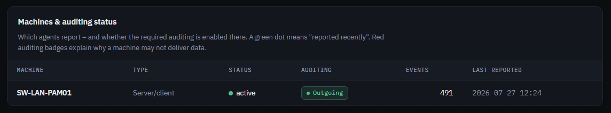

# NTLM-Analyzer

NTLM-Analyzer answers the question you have to answer before you can turn NTLM off: *who is still using it?* A lightweight Windows service on your domain controllers and member machines collects the relevant security events and pushes them to a central collector. Its web dashboard shows which users, computers and applications still authenticate over NTLM, which of them fell back from Kerberos (and can therefore be fixed), what already runs securely over Kerberos, and whether NTLM usage is trending toward zero.

I worked in the IT services industry for many years and identified many of these issues manually or using scripts at client sites. We handled numerous AD security projects for clients with critical infrastructure. We disabled NTLM/NTLMv2 wherever possible and migrated everything to Kerberos. After earning my OSCP and OSEP certifications, I finally wanted a tool that would significantly help with this work, since far too many companies still rely on NTLM and NTLMv2.

The collector is a single Python file with no external dependencies; the agent is a single, self-installing executable.

> [!NOTE]
> **Built with AI assistance.** Most of the code and documentation in this repository was written by Claude (Anthropic) in a pair-programming workflow: I defined the requirements, reviewed the results, and tested and deployed everything in a real Active Directory environment. As with any code you did not write yourself, review it before running it in production.

---

## Contents

- [Components](#components)
- [Features](#features)
- [Screenshots](#screenshots)
- [Prerequisites](#prerequisites)
- [Quick start](#quick-start)
- [CLI reference](#cli-reference)
- [Troubleshooting](#troubleshooting)
- [Limitations & notes](#limitations--notes)
- [Repository layout](#repository-layout)

---

## Components

| Component | File(s) | Platform | Description |
| --- | --- | --- | --- |
| **Collector** | `ntlm-collector.py` | Linux (any OS with Python 3.7+) | HTTP(S) server with ingest API, SQLite storage and an embedded web dashboard. Standard library only. |
| **Agent** | `ntlm-agent-rs/` | Windows (server & client, x64) | Native **Windows service** written in Rust (LocalSystem, auto-start, auto-restart on crash). A single, dependency-free EXE. |

One agent runs per machine — on domain controllers and member machines alike.

```
┌──────────────┐   ┌──────────────┐   ┌──────────────┐
│ DC (agent)   │   │ Server(agent)│   │ Client(agent)│
└──────┬───────┘   └──────┬───────┘   └──────┬───────┘
       │  POST /ingest + /status (HTTPS, X-Api-Key)  │
       └──────────────────┼──────────────────────────┘
                          ▼
                 ┌─────────────────┐
                 │    Collector    │  SQLite + web dashboard
                 │  (Python, TLS)  │  (login-protected)
                 └─────────────────┘
```

---

## Features

### Collection

| Event | Where | What it contributes |
| --- | --- | --- |
| **4624** | DCs (Security log) | NTLM logons with **v1/v2 distinction** via `LmPackageName` — which also catches **Negotiate→NTLM fallbacks** that a filter on `AuthenticationPackageName='NTLM'` would miss. Each event carries `auth_method = Direct \| Fallback`. |
| **8001** | all machines | **Outgoing** NTLM including the originating process — the "shutdown blocker" list. Kernel-redirector SMB access is labeled `(SMB/Kernel)`. |
| **8004** | DCs | NTLM authentication inside the domain (source → target → user). |
| **4769** | DCs *(optional)* | Kerberos service tickets — the "safe side": services and accounts already on Kerberos, including encryption (AES green, RC4 amber). |
| `/status` | all machines | Heartbeat plus the machine's auditing state, read from the registry. |

Watermarks are tracked per source and purpose, so only new events are transferred; the collector deduplicates on `(source, log, record_id)`.

### Dashboard

- **German / English UI** with a DE/EN toggle in the header — the choice is remembered in the browser and also applies to the login page.
- Dark, technical design. No external chart libraries, so it works on hosts without internet access.
- **Time-range filter** (24 h / 7 days / 30 days / all), applied server-side to every metric, table and the event list.
- **Trend chart**: NTLM activity per day (per hour in the 24 h view), stacked by v1 / v2 / unversioned — the curve that has to reach zero.
- **Work lists with status**: blocker and domain entries can be set to *open / in progress / done* (persisted). If a "done" entry produces new events, a red **"active again"** badge appears automatically.
- **What-to-do hints** per finding: the IP-instead-of-hostname classic for SMB, SPN checks (`setspn`), the fallback checklist (SPN / DNS / clock skew), switching RC4 tickets to AES (`msDS-SupportedEncryptionTypes`).
- **CSV export** of the current selection (UTF-8 BOM, semicolon delimiter, formula-injection protection).
- Clickable metrics, free-text search, filter chips, auto-refresh, and a machine panel with heartbeat and audit traffic lights.

### Security

- **TLS** built into the collector (`--cert` / `--tlskey`, minimum TLS 1.2); the session cookie becomes `Secure` automatically over HTTPS.
- **Dashboard login** (optional): PBKDF2-HMAC-SHA256 (200,000 iterations), constant-time comparison, `HttpOnly` + `SameSite` cookie, per-source-IP brute-force lockout.
- **API key** for the agent endpoints (`X-Api-Key`, constant-time comparison), separate from the browser login.
- Request size limits, fully parameterized SQL, complete HTML escaping (no stored XSS via event contents), CSV formula-injection protection.
- The agent is a **pure client** (no listening port), ignores collector responses (no control channel), invokes helper binaries only via absolute System32 paths, installs itself into `C:\Program Files\NtlmAgent\`, and restricts the ACL of `C:\ProgramData\NtlmAgent\` to SYSTEM + Administrators (SID-based, locale-independent).

### Operations

- **Retention**: `--retention-days N` deletes old events automatically (at startup and every 6 hours).
- Indexes on all query columns; automatic schema migration at startup — existing databases are upgraded in place.
- Agent: log rotation at 5 MB, atomic watermark writes, 15 s HTTP timeout, per-cycle panic safety net.

---

## Screenshots


*The dashboard: key metrics, the NTLM-over-time trend, and who still authenticates over NTLM.*



*Agent health: which machines report in, their heartbeat, and whether the required auditing is enabled on each.*

---

## Prerequisites

### Auditing (GPO) — required, nothing is collected without it

The agent only reads events that Windows actually writes. Enable the following via Group Policy.

> [!IMPORTANT]
> Events are generated **from the moment auditing is enabled — not retroactively.**

#### On all machines (servers and clients)

`Computer Configuration → Policies → Windows Settings → Security Settings → Local Policies → Security Options`

| Setting | Value | Produces |
| --- | --- | --- |
| Network security: Restrict NTLM: **Outgoing NTLM traffic to remote servers** | `Audit all` | **Event 8001** — outgoing NTLM including the originating process |
| Network security: Restrict NTLM: **Audit Incoming NTLM Traffic** *(optional)* | `Enable auditing for all accounts` | No collected events; turns the dashboard's incoming-audit badge green |

> [!WARNING]
> Choose **`Audit all`**, not `Deny all` — auditing only logs, it blocks nothing.

#### On domain controllers (in addition)

`Computer Configuration → Policies → Windows Settings → Security Settings → Local Policies → Security Options`

| Setting | Value | Produces |
| --- | --- | --- |
| Network security: Restrict NTLM: **Audit NTLM authentication in this domain** | `Enable all` | **Event 8004** — who uses NTLM against which server |

`Computer Configuration → Policies → Windows Settings → Security Settings → Advanced Audit Policy Configuration → Audit Policies`

| Category → Subcategory | Value | Produces |
| --- | --- | --- |
| Logon/Logoff → **Audit Logon** | `Success` | **Event 4624** — the only source of the NTLMv1/v2 distinction and of Kerberos-fallback detection |
| Account Logon → **Audit Kerberos Service Ticket Operations** *(optional)* | `Success` | **Event 4769** — Kerberos services and accounts ("the safe side") |

#### Applying and verifying

```cmd
gpupdate /force
auditpol /get /subcategory:"Logon"
```

`auditpol` must report **Success** for the Logon subcategory. In the dashboard, the **Machines & auditing status** panel turns its audit badges green as soon as each agent reports in — use it to confirm the policy actually landed on every machine.

### Collector (central server)

- **Python ≥ 3.7** — standard library only, no `pip install` required.
  On AlmaLinux 8 the system Python is 3.6: install `python3.11` and run with that. AlmaLinux 9 (Python 3.9) works out of the box.
- One reachable TCP port (e.g. 8080 for HTTP, 8443 for HTTPS), opened in the host firewall — on RHEL-family systems: `firewall-cmd --add-port=8443/tcp --permanent && firewall-cmd --reload`.
- For HTTPS: certificate and key in PEM format. Recommended: a certificate from your **internal CA (AD CS)** with the collector's DNS name as CN/SAN — every domain member trusts it automatically.

### Agent (each monitored Windows machine)

- Windows Server or client, x64.
- **Administrator rights for installation**; the service itself then runs as `LocalSystem`, which grants the Security-log access needed on domain controllers.
- Network access to the collector's port, and name resolution for the collector host.
- The agent's URL scheme and port must match how the collector was started (`http://` vs `https://`).

### Building the agent (once; a single build machine is enough)

- **Rust toolchain** (`rustup`, stable) with the **MSVC target**, plus the *Visual Studio Build Tools* with "Desktop development with C++".
- Internet access to crates.io for the first build.
- `cargo build --release` produces a single, dependency-free `ntlm-agent.exe` that can be copied to every target machine.
- Optional: sign the EXE with a code-signing certificate from your internal CA (`signtool sign /fd SHA256 /sha1 <thumbprint> /tr <timestamp-url> /td SHA256 ntlm-agent.exe`) to avoid "unknown publisher" prompts and to enable publisher-based AppLocker/WDAC rules.

---

## Quick start

**1. Start the collector** (Linux):

```bash
NTLM_DASHBOARD_PASSWORD='StrongPassword' python3 ntlm-collector.py \
    --port 8443 --db /var/lib/ntlm-collector/ntlm.db \
    --key 'AgentSecret' --retention-days 90 \
    --cert /etc/ntlm-collector/server.crt --tlskey /etc/ntlm-collector/server.key
```

Without `--cert`/`--tlskey` the collector runs over plain HTTP (testing only). Without `--password` the dashboard is open, without `--key` the ingest API is open — both are clearly flagged in the startup banner, which also tells you the exact scheme and port the agents must use.

**2. Build the agent** (once, on a Windows machine with Rust):

```cmd
cd ntlm-agent-rs
cargo build --release
```

**3. Deploy the agent** (per machine, in an **elevated** command prompt):

```cmd
ntlm-agent.exe install --collector-url https://collector.example.local:8443 --api-key AgentSecret
```

One command does everything: copies the EXE to `C:\Program Files\NtlmAgent\`, hardens the ACLs, creates the service (auto-start, auto-restart) and starts it. Control it via `services.msc` or `sc start|stop NtlmAgent`; test without the service using `ntlm-agent.exe run`; remove it with `ntlm-agent.exe uninstall`.

**4. Open the dashboard:** `https://collector.example.local:8443/` → sign in → confirm in the **Machines & auditing status** panel that every agent reports with a green heartbeat and green audit badges.

---

## CLI reference

**Collector**

| Option | Purpose |
| --- | --- |
| `--port`, `--host`, `--db` | Listener and database path |
| `--key` | API key required from agents (`X-Api-Key`) |
| `--password` / `NTLM_DASHBOARD_PASSWORD` | Enables the dashboard login |
| `--cert`, `--tlskey` | PEM certificate and key → enables HTTPS |
| `--secure-cookie` | Forces the `Secure` cookie flag (automatic with TLS) |
| `--retention-days N` | Deletes events older than N days |

**Agent**

| Command | Purpose |
| --- | --- |
| `install --collector-url <URL> [--api-key K] [--interval MIN] [--days-back N] [--skip-kerberos] [--enable-outgoing-audit]` | Writes the config, installs and starts the service |
| `uninstall` | Stops and removes the service |
| `run` | One-off collect/push cycle in the console (for testing) |
| `service` | Internal — invoked by the service control manager |

Configuration, watermarks and log live under `C:\ProgramData\NtlmAgent\` (`config.json`, `state.json`, `agent.log`).

---

## Troubleshooting

**`install` fails with "the service already exists".**
A previous attempt left the service behind. Run `ntlm-agent.exe uninstall`, then install again. If the service is stuck in *marked for deletion*, close any open `services.msc` window and retry.

**The machine never appears in the "Machines & auditing status" panel.**
The agent cannot reach the collector — check `C:\ProgramData\NtlmAgent\agent.log`. The most common cause is a scheme/port mismatch: an agent configured with `http://` talking to a TLS port (or vice versa). Verify from the Windows machine with `curl.exe http://<host>:<port>/healthz` and `curl.exe -k https://<host>:<port>/healthz` — whichever answers is the correct URL. Also check the collector host's firewall. After editing `config.json`, restart the service (`sc stop NtlmAgent` / `sc start NtlmAgent`) — the configuration is only read at startup.

**The machine reports in, but shows 0 events and a red "Outgoing off" badge.**
Outgoing NTLM auditing is not active on that machine, so Windows writes no 8001 events. Apply the GPO above, or install the agent with `--enable-outgoing-audit`. On a quiet machine, events may simply take a while — accessing a share by **IP address** (`dir \\<ip>\share`) reliably produces NTLM traffic for a test.

**Almost everything shows up as "unversioned".**
Expected: only event 4624 carries `LmPackageName`, i.e. the NTLMv1/v2 information. Events 8001 and 8004 never contain a version by design and therefore appear gray. To populate the *insecure* / *outdated* metrics you need an agent on a **domain controller** with **Audit Logon** enabled. A large gray share remains normal even then — the same logon can appear as 8004 (gray) *and* as 4624 (red/amber), since these are separate events from separate logs.

**No Kerberos data.**
4769 is collected on domain controllers only, and only when the agent was not installed with `--skip-kerberos`. Check `skip_kerberos` in `config.json` and that *Audit Kerberos Service Ticket Operations* is enabled.

---

## Limitations & notes

- **Not retroactive:** collection starts when auditing is enabled; the first run looks back `--days-back` days (default 1).
- The fields of events 8001/8004 are parsed **positionally** (Microsoft ships them unnamed); the order was verified against current Windows Server builds and could differ on exotic ones.
- Timestamps: the agent records events in UTC, while the collector's time-range filter uses the server's local time — at the edges of a time window this can shift results by the timezone offset (irrelevant for daily/weekly analysis).
- The dashboard is an analysis aid — the actual NTLM shutdown (deny policies, exception lists) is deliberately **not** performed by this tool.
- SQLite is more than sufficient here; for very large environments set `--retention-days`.

## Repository layout

```
README.md                     this file
LICENSE                       MIT
.gitignore                    keeps databases, logs, certificates and build output out of git
.github/workflows/            CI: builds ntlm-agent.exe on Windows and publishes it as an artifact
screenshots/                  images used in this README
ntlm-collector.py             the collector (server + dashboard, single file)
ntlm-agent-rs/                the Windows agent (Rust)
├── README.md                 build, install and service control
├── Cargo.toml
└── src/                      main, config, eventlog, agent, service
```

Prebuilt binaries: every push to `main` builds the agent via GitHub Actions — download `ntlm-agent.exe` from the run's *Artifacts* section, or from the release assets of a tagged version.

## License

[MIT](LICENSE) — see the `LICENSE` file. Replace the placeholder copyright holder with your name or organization before publishing.
