<div align="center">


# NTLM-Analyzer

### Find out who still uses NTLM in your Active Directory — so you can retire it for Kerberos.

A Windows agent plus a central collector with a web dashboard: which users,
computers and programs still authenticate over NTLM, which of them fell back
from Kerberos (and can be fixed), and whether usage is trending toward zero.
The collector is one Python file with no dependencies; the agent is one
self-installing EXE.

[](https://nobrac.github.io/NTLM-Analyzer/)
&nbsp;

&nbsp;

&nbsp;

&nbsp;
[](LICENSE)

**[▶ Live demo](https://nobrac.github.io/NTLM-Analyzer/)** — the real dashboard
on synthetic lab data. Charts, drill-downs, search, filters and the per-event
detail view all work.

</div>

> [!NOTE]
> **Built with AI assistance.** Most of the code was written by Claude
> (Anthropic) in a pair-programming workflow; I defined requirements, reviewed
> and tested everything in a real AD environment. Review it before production
> use, as you would any code you did not write.

---

## Screenshots

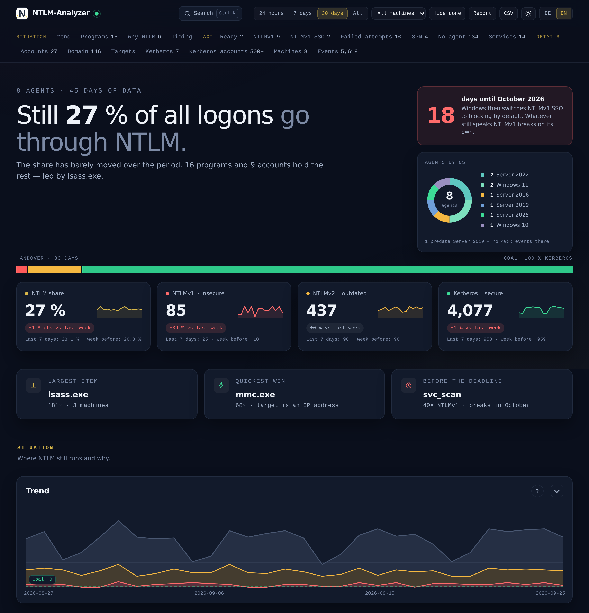

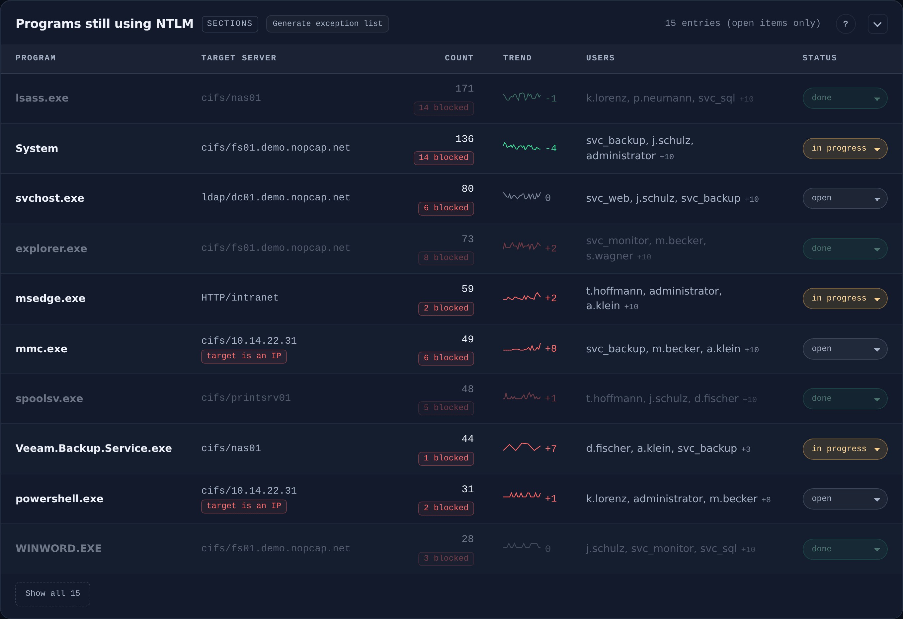

<details>
<summary><b>More screenshots</b> — timing heatmap, cause analysis, Kerberos side, machine readiness, event detail …</summary>
<br>

**Most-used targets and insecure logons by account**
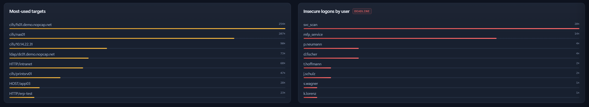

**When NTLM happens** — the bright cell on Sunday 05:00 is the backup job nobody remembers
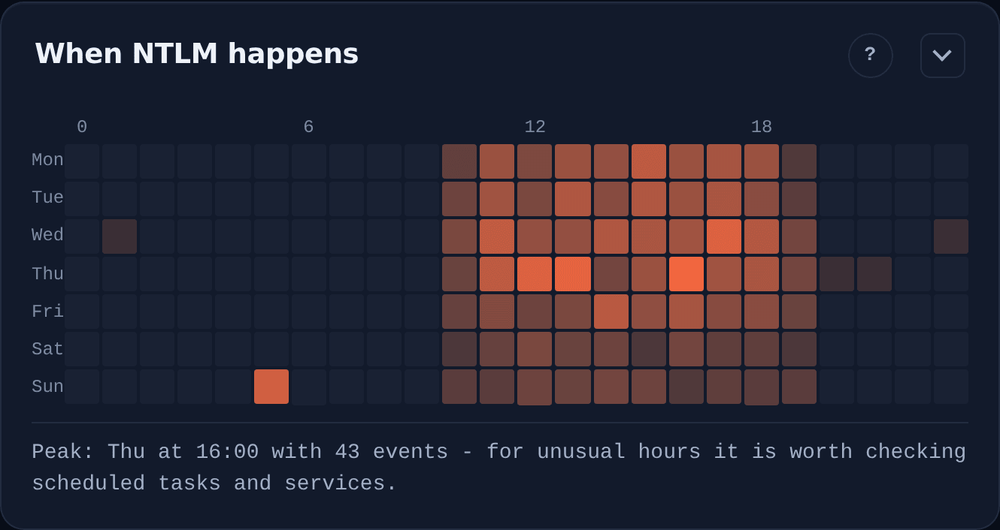

**Why NTLM was used** — each cause with its concrete remedy, each row clickable
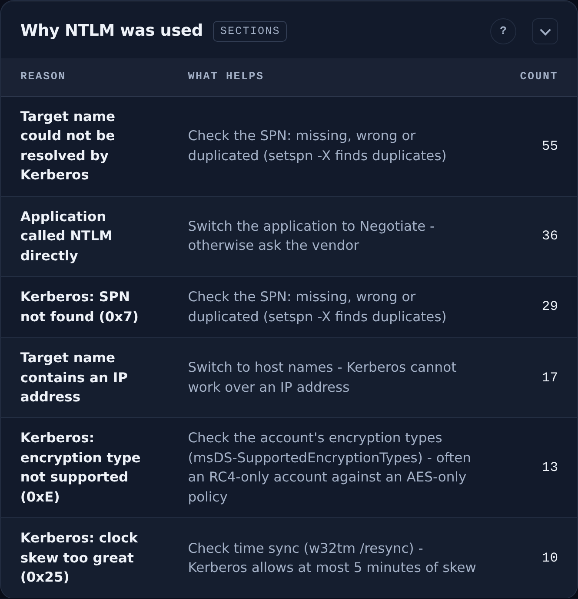

**Who uses NTLM — and where to** (from the domain controller)
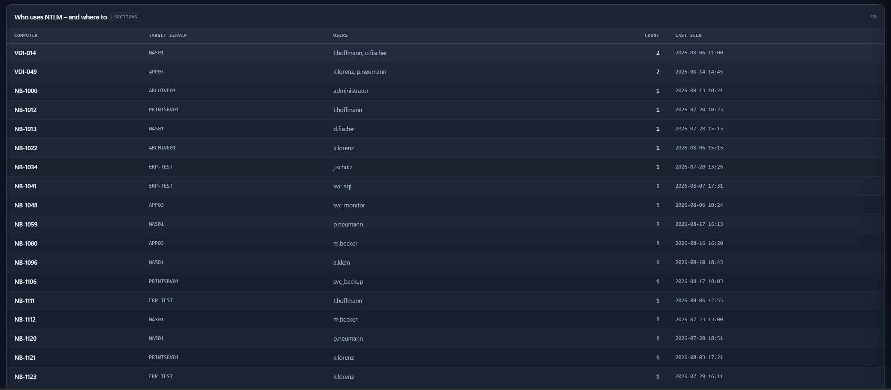

**Services accepting NTLM** — the receiving side
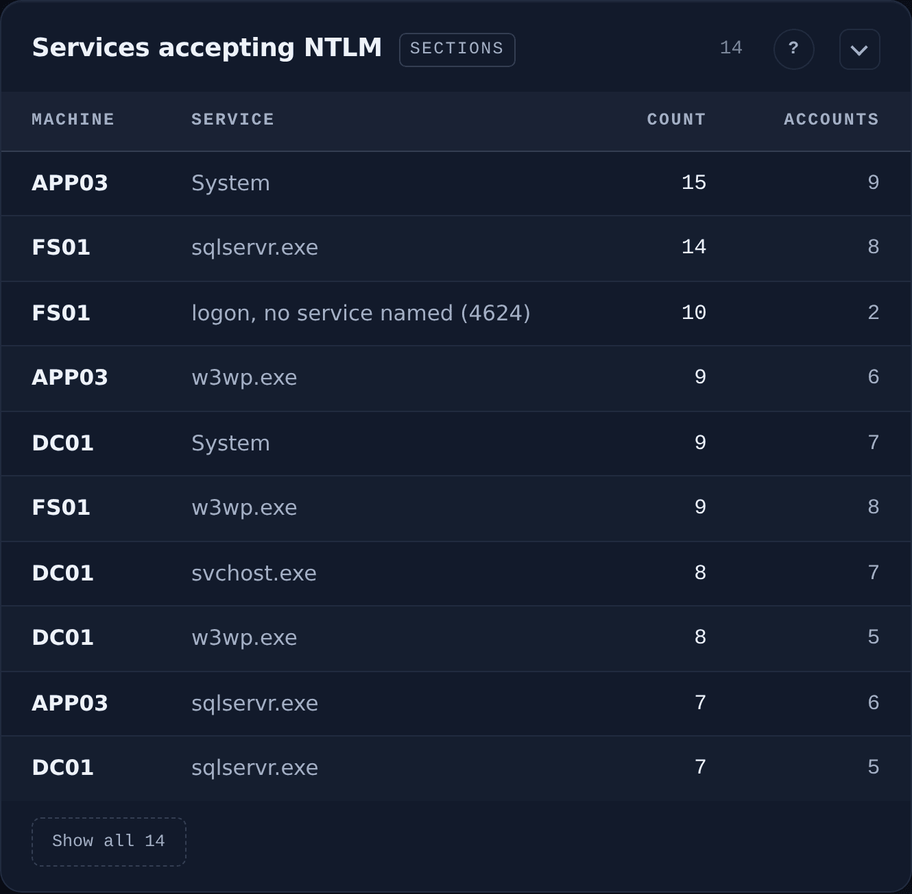

**NTLMv1 SSO** — breaks on its own in October 2026
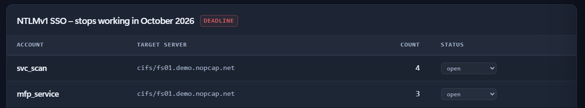

**Already on Kerberos** — the safe side, including weak-encryption findings
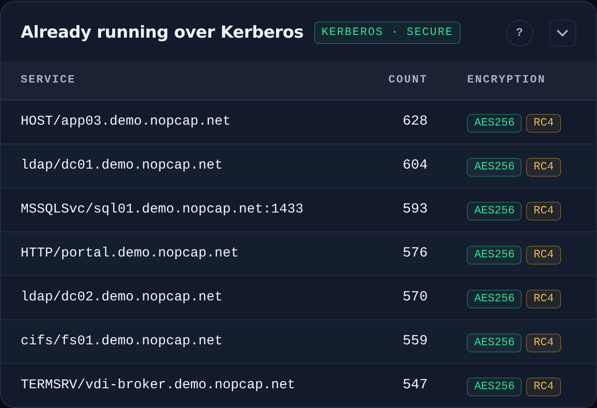

**Machines & auditing status** — OS builds, audit badges, Oct 2026 readiness
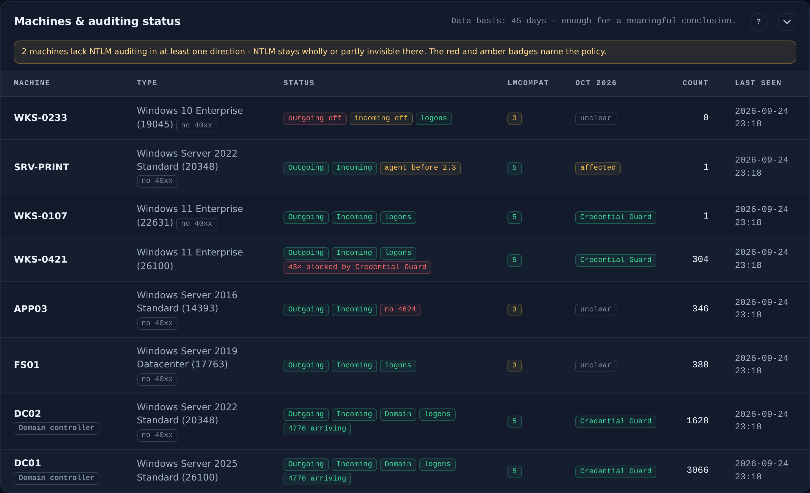

**Recent events** — filterable, searchable, CSV export
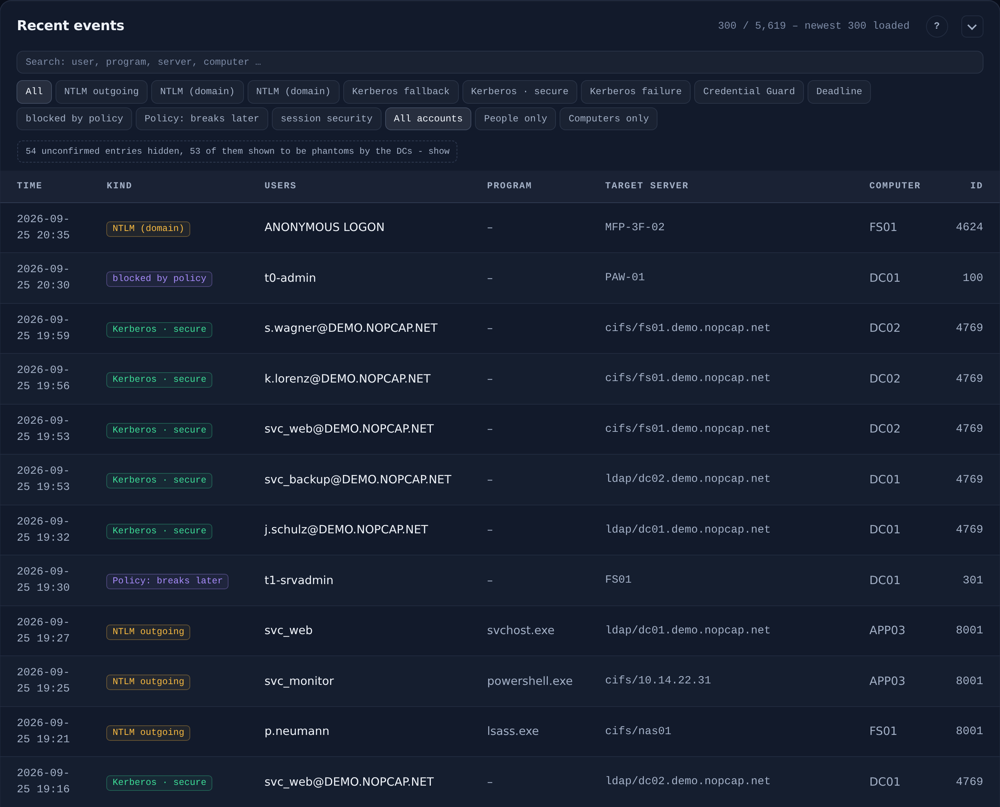

**Event detail** — every raw field, with an explanation of the event ID
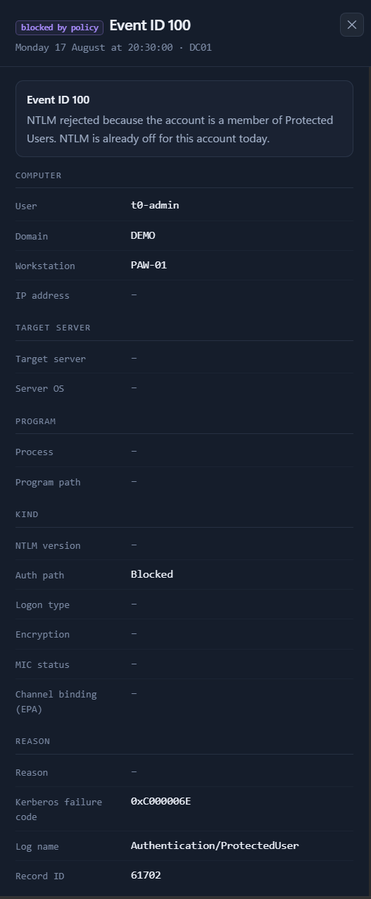

</details>

---

## Quick start

### 1. Enable auditing (GPO) — nothing is collected without it

Events are written **from the moment auditing is on, not retroactively.**
Under `Computer Configuration → Policies → Windows Settings → Security Settings`:

| Where | Setting | Value |
| --- | --- | --- |
| All machines · *Local Policies → Security Options* | Restrict NTLM: **Outgoing NTLM traffic to remote servers** | `Audit all` — **not** `Deny all` |
| All machines · *Local Policies → Security Options* | Restrict NTLM: **Audit Incoming NTLM Traffic** | `Enable auditing for domain accounts` |
| DCs · *Local Policies → Security Options* | Restrict NTLM: **Audit NTLM authentication in this domain** | `Enable all` |
| DCs · *Advanced Audit Policy → Logon/Logoff* | **Audit Logon** | `Success` — the only source of the NTLMv1/v2 distinction |
| DCs · *Advanced Audit Policy → Account Logon* (optional) | **Audit Kerberos Service Ticket Operations** | `Success and Failure` — failures feed the *Why NTLM?* panel |

Then `gpupdate /force`. The dashboard's **Machines & auditing status** panel
turns its badges green once the policy has landed on each machine.

### 2. Install the collector (Linux)

```bash
sudo ./install.sh
```

Detects Debian/RHEL, creates a hardened systemd service, keeps password and API
key out of the command line, and prints the finished agent install command.
(Manual start: `python3 ntlm-collector.py --help` — no pip packages needed.)

### 3. Install the agent (per Windows machine, elevated)

Download `ntlm-agent.msi` from the [latest release](../../releases/latest) and
double-click, or unattended:

```cmd
msiexec /i ntlm-agent.msi /qn COLLECTORURL=https://collector.example.local:8443
```

Or with the bare EXE: `ntlm-agent.exe install --collector-url https://… --api-key …`
— copies itself to Program Files, hardens ACLs, registers and starts the service.

### 4. Open the dashboard

`https://collector.example.local:8443/` → the **Machines** panel should show
every agent with a green heartbeat.

---

## Good to know

- **Security:** the dashboard is a single page with **zero external requests**,
  a `default-src 'none'` CSP, login on every endpoint and XSS-tested rendering.
  Run the collector with TLS (`--cert`/`--tlskey`) and `--password`; plain HTTP
  is for testing only.
- **Least privilege:** the agent can run as a **gMSA** instead of LocalSystem —
  see the [agent README](ntlm-agent-rs/README.md), which also covers the MSI
  properties and how to handle the API key in unattended rollouts.
- **Enhanced 40xx events** (process names for NTLM) exist on Windows 11 24H2 /
  Server 2025 only; older systems still deliver everything else, and the
  dashboard says so instead of showing empty panels.
- All CLI options: `python3 ntlm-collector.py --help` and `ntlm-agent.exe --help`.
- **Everything else** — component details, every CLI flag, troubleshooting and
  the checklist for actually turning NTLM off — lives in the
  [operations guide](docs/OPERATIONS.md).

## License

GPL-3.0 — see [LICENSE](LICENSE).
